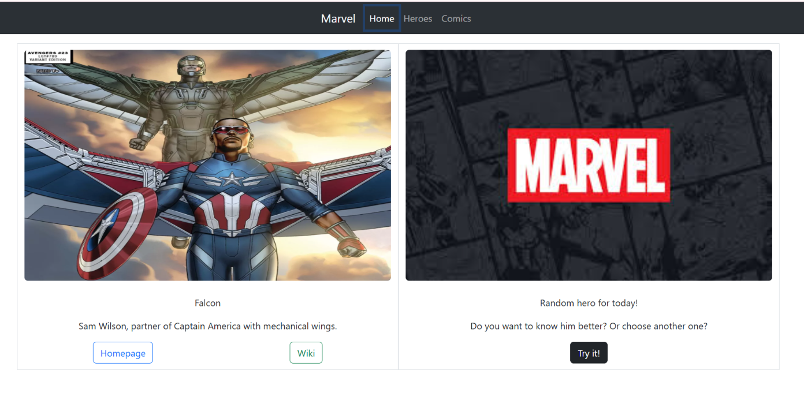
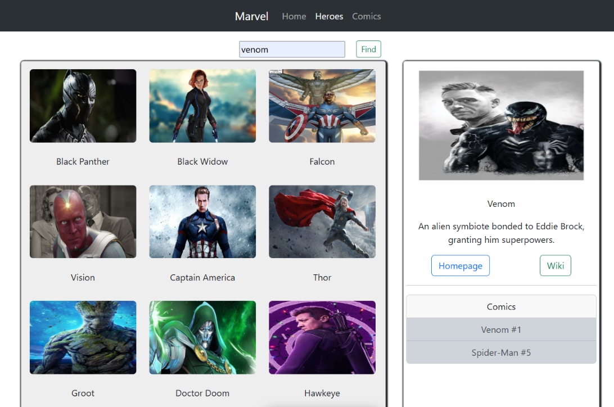
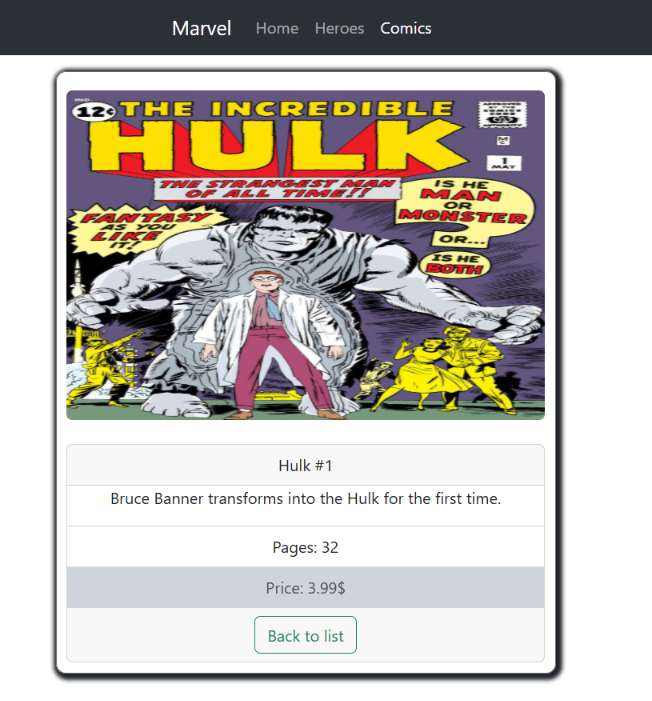

# 🦸‍♂️ Marvel Comics API Project

An educational React application for searching and browsing information about the Marvel Universe. This project demonstrates working with REST APIs, custom hooks, and complex form handling.

**🔗 Live Demo:** [View Project](https://olehkuts.github.io/comics_api_project/)

---

## 🚀 Features

The application is divided into three main sections:

- **Home (Random Hero):**
  - Generate a random character with a single click.
  - Direct links to Wiki and the official Marvel website for each character.
- **Heroes:**
  - Dynamic grid displaying characters.
  - "Load More" functionality to fetch the next batch of heroes from the API.
  - Detailed character information displayed upon selection.
  - Search panel to find specific heroes within the loaded data.
- **Comics:**
  - Browse the Marvel comics library with similar "Load More" logic.
  - **Dynamic Routing:** Click on any comic to open a dedicated page with detailed information.

---

## 🛠 Tech Stack

- **React (Functional Components):** Modern UI development approach.
- **Custom Hooks & Services:** Managed via `ComicsService` combined with a custom logic hook for clean API interactions.
- **React Router v5:** Seamless navigation between application views.
- **Formik & Yup:** Robust form management and search validation.
- **React Bootstrap:** Responsive layout and UI components.
- **Marvel API:** Primary data source for characters and comics.

---

## 📸 Screenshots





---

## 📦 Local Setup

1. Clone the repository:
   ```bash
   git clone https://github.com
   ```
2. Navigate to the project directory:
   ```bash
   cd comics_api_project
   ```
3. Install dependencies:
   ```bash
   npm install
   ```
4. Start the development server:
   ```bash
   npm start
   ```

_Developed by [Oleh Kuts](https://github.com/OlehKuts)_
